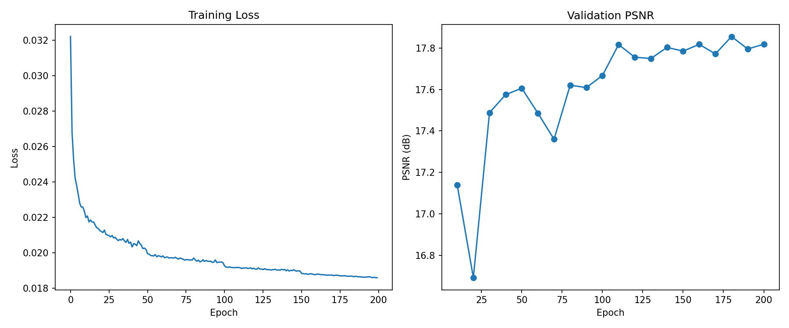
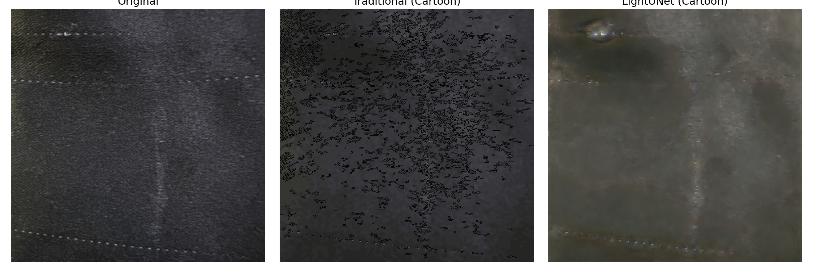
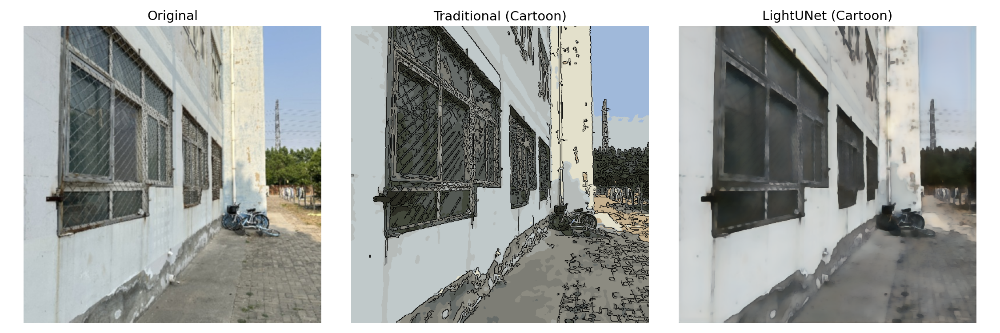
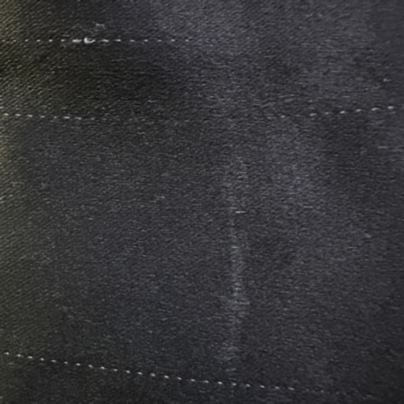
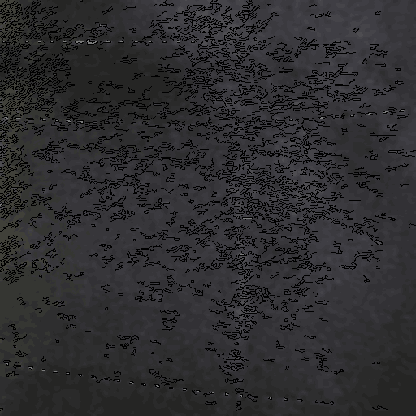
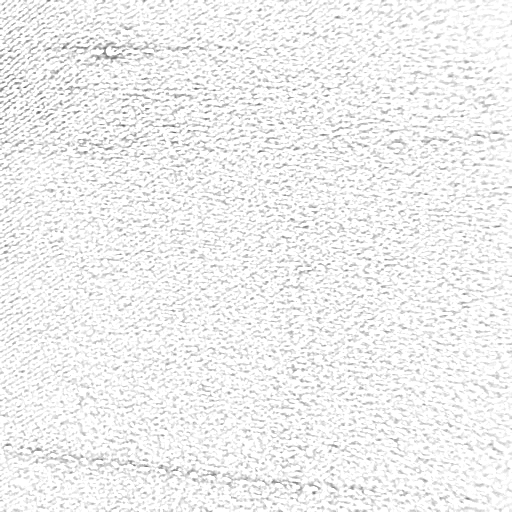
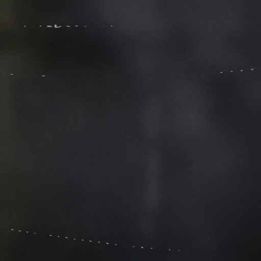
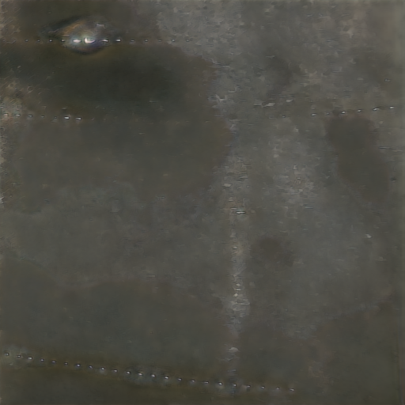

# 双流画境 — 多风格图像艺术化系统

基于传统图像处理与深度学习的双管线图像风格化系统。传统 OpenCV 管线实现卡通化、素描化、水彩化三种风格；深度学习管线采用自建 LightUNet（712 万参数），以传统卡通化输出为教师标签进行知识蒸馏训练。原始数据集 320 张照片全部由 iPhone 手机自主拍摄。

## 效果展示

### 训练曲线



### 双管线对比

原图 vs 传统管线 vs 深度学习（LightUNet）：




### 五种风格效果

| 原图 | 传统卡通 | 传统素描 | 传统水彩 | 深度学习卡通 |
|------|----------|----------|----------|-------------|
|  |  |  |  |  |

### 评估指标

| 指标 | 传统算法 | LightUNet |
|------|----------|-----------|
| SSIM | 0.9395 | 0.5558 |
| PSNR | 33.02 dB | 17.45 dB |
| 推理速度 | 557.30 ms | 29.23 ms |

> 推理速度差距约 19×。LightUNet 的质量指标低于传统管线符合预期——这是知识蒸馏场景的特征（学生网络可接受的质量损失换取推理效率）。SSIM/PSNR 以传统卡通化输出为 ground truth 计算，深度学习的目标是逼近教师标签而非超越。

## 环境要求

- Python 3.8+
- CUDA 12.1
- 显存 ≥ 6 GB（已在 RTX 4050 Laptop 6GB 测试通过）
- Windows 10/11

## 安装

```bash
cd CV_Final
python -m venv venv
.\venv\Scripts\activate
pip install torch torchvision --index-url https://download.pytorch.org/whl/cu121
pip install -r requirements.txt
```

依赖：torch, opencv-python, numpy, scikit-image, scikit-learn, matplotlib, tqdm, pillow。

## 运行

### 全量运行

```bash
python src/run_pipeline.py
```

按顺序执行：预处理 → 标签生成 → 训练（200 轮，早停监控）→ 评估。预计 2.5–3 小时（GPU）。

### 冒烟测试（约 8 分钟）

```bash
python src/quick_test.py
```

80 张随机图像、5 轮训练，快速验证管线完整性。

### 分步执行

```bash
python src/preprocess.py              # 清晰度筛选 + 缩放 + 去噪 + 增强 + 数据划分
python src/preprocess.py --max-total 32   # 限制图像数，快速调试
python src/generate_labels.py         # 传统卡通化生成教师标签
python src/train.py                   # 训练 LightUNet（默认 200 轮）
python src/train.py --epochs 10       # 指定轮数，快速验证
python src/test.py                    # 测试集评估 + 生成对比图
python src/export_styles.py           # 导出各风格独立效果图
```

## 项目结构

```
CV_Final/
├── assets/                   # 效果展示图
├── src/                      # 全部源代码（14 个模块）
│   ├── config.py             # 集中路径、超参数、随机种子设置
│   ├── dataset.py            # PyTorch Dataset，内存预加载策略
│   ├── preprocess.py         # 拉普拉斯清晰度筛选、缩放、去噪、增强、分层划分
│   ├── traditional.py        # 卡通化 / 素描化 / 水彩化（纯 OpenCV 手写）
│   ├── generate_labels.py    # 批量运行传统卡通化生成教师标签
│   ├── model.py              # LightUNet 架构 + SE 通道注意力模块
│   ├── loss.py               # 混合损失（MSE + TV + 自研 ColorStatLoss）
│   ├── train.py              # 训练循环（AMP 混合精度、早停）
│   ├── test.py               # 测试集评估（SSIM / PSNR / 推理速度）
│   ├── export_styles.py      # 导出各风格独立效果图
│   ├── run_pipeline.py       # 一键全量运行入口
│   ├── quick_test.py         # 冒烟测试入口
│   └── utils.py              # 图像 I/O（含中文路径兼容）、可视化、评估指标
├── dataset/                  # 原始数据集（gitignored，需自行准备）
│   └── raw/                  #   portrait / indoor / outdoor / still 各 80 张
├── checkpoints/              # 训练产出：最佳模型权重（gitignored）
├── results/                  # 训练产出：曲线、对比图、评估报告（gitignored）
├── requirements.txt          # Python 依赖
└── README.md
```

## 关键设计

- **双管线对比**：传统 OpenCV（卡通/素描/水彩）→ 教师标签 → LightUNet 知识蒸馏 → 统一测试集对比
- **LightUNet**：4 层编码器-解码器，SE 通道注意力（reduction=4），总参数量 7,120,771
- **ColorStatLoss**：自研可微逐通道均值/方差匹配，替代不可微直方图距离
- **可复现性**：统一随机种子（seed=42），cudnn.deterministic=True
- **Windows 兼容**：`imread_any` / `imwrite_any` 处理中文路径
